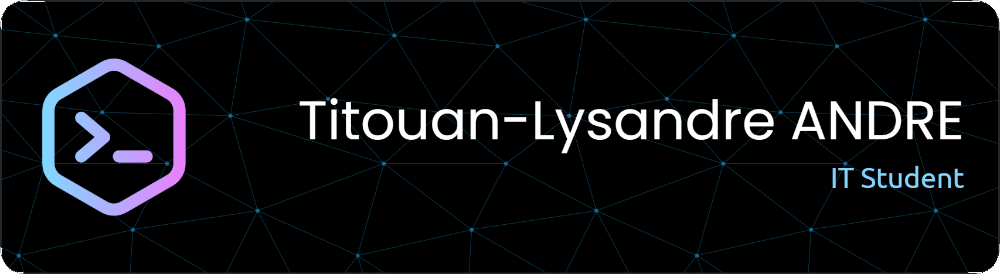

<h2>Hey there! I'm Titouan-Lysandre</h2>

<!-- ## 👋 &nbsp;Hey there! I'm Titouan-Lysandre -->

### 👨🏻‍💻 &nbsp;About Me

💡 &nbsp;I like to explore new technologies and develop software and web applications.\
🎓 &nbsp;I'm currently studying Computer Science at the IUT Lyon 1.\
💻 &nbsp;I'm on track for learning more about different web languages, I'm interested in both Front & Back end.\
🎵 &nbsp;In my free time, I usually play music or go climbing as hobbies/side hustles.\
✉️ &nbsp;You can shoot me an email at titouan.lysandre@gmail.com ! I'll try to respond as soon as I can.

### 🛠 &nbsp;Tech Stack

&nbsp;
&nbsp;
&nbsp;
&nbsp;\
&nbsp;
&nbsp;
&nbsp;
&nbsp;\
&nbsp;
&nbsp;
&nbsp;
&nbsp;\
&nbsp;
&nbsp;
&nbsp;
&nbsp;  

### ⚙️ &nbsp;GitHub Analytics

### 🤝🏻 &nbsp;Connect with Me

